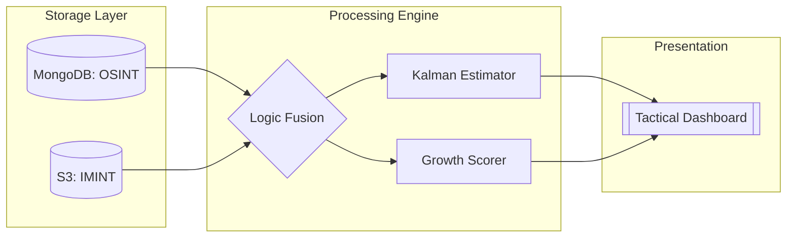

# Strategic India Intelligence Platform (STRATEGIC-COP)

A high-fidelity, web-based intelligence fusion dashboard designed to provide a unified "Common Operating Picture" (COP) for tactical operations across the Indian subcontinent.

## 🚀 Overview
This platform integrates multi-modal data sources (OSINT, HUMINT, IMINT) into an interactive geospatial interface. It solves four critical intelligence challenges using a modern Tactical Design System (Glassmorphism, Dark Mode, and Real-Time Animations).

## 🛠️ Core Features

### 1. Multi-Source Intelligence Fusion
- **OSINT Analysis**: Automatic parsing of public infrastructure tenders and social vectors.
- **HUMINT Integration**: Field asset reports and manual sighting verification.
- **IMINT Hover-and-View**: High-resolution satellite imagery inspection with thermal signature analysis.

### 2. Predictive LoRa Telemetry Reconstruction
- **Packet Repair**: Intelligent middleware to handle fragmented or malformed JSON data strings.
- **Kalman Filtering**: 2D state estimation for predictive continuity when LoRa signals are lost.
- **Visual Confidence**: Distinct markers for "Verified" ground-truth and "Estimated" predicted paths.

### 3. Predictive Urban Growth Modeling
- **Growth Velocity Score (GVS)**: Algorithmic weightage of municipal intent (Tenders) vs. market demand (Price trends).
- **Time-Series Projection**: A 24–60 month timeline slider visualizing future urban "hotspots" via dynamic heatmaps.

### 4. Real-Time Logistics & Traffic Modeling
- **Sensing Layer**: Live congestion monitoring on major transit corridors (e.g., Delhi Ring Road, Bangalore Silk Board).
- **Adaptive Rerouting**: Autonomous pathfinding for specialized fleet units.
- **Hazardous Buffers**: Dynamic safety halos for HAZMAT assets based on velocity and traffic density.

## 🖥️ Tactical User Interface
- **War-Room Aesthetic**: Ultra-dark charcoal palette with neon data overlays.
- **Live Debug Terminal**: Matrix-style scrolling logs showing the underlying mathematical logic.
- **Global Radar Sweep**: Visual conic surveillance scan for enhanced situational immersion.

## 📐 Architecture & Logic Deep-Dive

### 1. Unified Intelligence Logic (app.js)
The orchestrator manages asymmetric data streams using a **Layered Fusion** approach:
- **Asynchronicity**: Real-time feeds from MongoDB (OSINT) and S3 (IMINT) are simulated via asynchronous event loops, ensuring the UI remains responsive (60fps).
- **Event Bus**: User interactions (filtering, timeline sliding) trigger localized re-renders of Leaflet layer groups, minimizing DOM overhead.

### 2. Predictive Reconstruction (telemetryProcessor.js)
To satisfy the "State Estimation" requirement, the platform uses a **2D Kalman Filter**:
- **t-1 & t-2 States**: The engine stores the last two known positions and calculates a velocity vector.
- **Heuristic Repair**: Fragmented JSON strings are repaired using regex-based pattern matching before being passed to the estimator.
- **Confidence Scoring**: Estimated nodes (🟡) are assigned a transparency value based on the variance of the prediction.

### 3. Growth Velocity Scoring (growthEngine.js)
The "Predictive Urban Growth" model uses a weighted algorithm:
- **Supply-Side**: Government tender density (from OSINT).
- **Demand-Side**: Real estate price volatility (from OSINT).
- **Output**: A 0.0 to 1.0 intensity score visualized via a localized heatmap.

## 🗄️ Backend Data Flow

## 🎯 Mapping to Problem Statement

| Requirement | Implementation Feature |
| :--- | :--- |
| **Common Operating Picture** | Unified Leaflet Map with 6 toggleable intelligence layers. |
| **Multi-Modal Data Fusion** | Integration of OSINT, HUMINT, and IMINT (Mocked S3/MongoDB). |
| **State Estimation (t-1, t-2)** | `telemetryProcessor.js` using Kalman Filter for predictive continuity. |
| **Fragmented Data Repair** | `fixBrokenJSON()` and `repairPacket()` heuristic logic. |
| **Rich Aesthetics** | Tactical Dark Mode, Glassmorphism, and Conic Radar Scans. |
| **Hover Previews** | `tactical-tooltip` showing rich metadata and image previews on hover. |
| **Storage Integration** | Mocked **MongoDB** (for OSINT Vector logs) and **AWS S3** (for IMINT imagery storage). |

## 📦 Project Structure
- `index.html`: Core UI structure & Layer management.
- `style.css`: Tactical design system and glassmorphism tokens.
- `app.js`: Main logic orchestrating the fusion of data layers.
- `telemetryProcessor.js`: The "Brain" for LoRa repair and Kalman estimation.
- `growthEngine.js`: Algorithmic engine for real estate predictive modeling.
- `logisticsEngine.js`: Routing and congestion sensing logic.

## 🚦 Getting Started
1. Open `index.html` in a modern browser.
2. Hover over markers to see **Rich IMINT Previews**.
3. Observe the **Live Terminal** for "Packet Repair" logs (simulating LoRa bit-rot).
4. Drag a file onto the **Manual Ingestion** zone to simulate an IMINT upload.

---
*Developed as an end-to-end Strategic Intelligence solution.*
